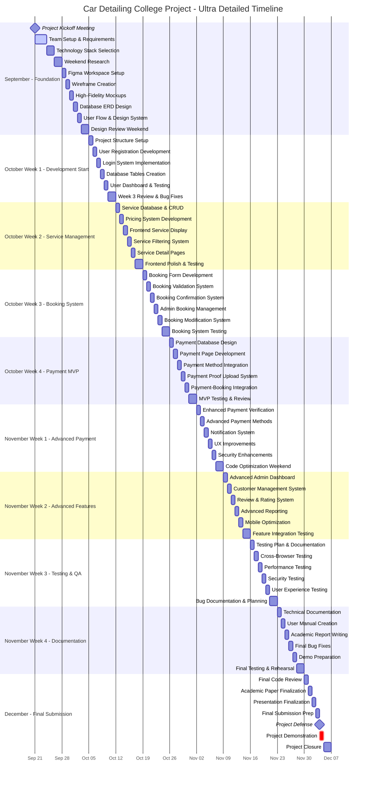

# 📊 Ultra-Detailed Visual Gantt Chart - Daily Task Level

## 🎯 **MERMAID GANTT CHART (DAILY TASKS)**
Copy this code to https://mermaid.live/ for ultra-detailed visualization:



## 🎯 **GOOGLE SHEETS TEMPLATE (ULTRA DETAILED)**
Copy this data for comprehensive project tracking:

```csv
Date,Week,Day,Task Category,Specific Task,Time Estimate,Priority,Assigned To,Status,Dependencies,Deliverable
2025-09-21,1,Monday,Project Setup,Project kickoff meeting,2 hours,High,Team,Completed,,Meeting minutes
2025-09-21,1,Monday,Project Setup,Team role assignments,1 hour,High,PM,Completed,,Role matrix
2025-09-21,1,Monday,Project Setup,Communication channels setup,30 min,Medium,Team,Completed,,Discord/Slack
2025-09-22,1,Tuesday,Research,Business requirements gathering,3 hours,High,BA,Completed,,Requirements doc
2025-09-22,1,Tuesday,Research,Competitor analysis,2 hours,Medium,Team,Completed,,Analysis report
2025-09-23,1,Wednesday,Technical Setup,XAMPP installation,1 hour,High,Dev Team,Completed,,Working environment
2025-09-23,1,Wednesday,Technical Setup,MySQL database creation,1 hour,High,Backend Dev,Completed,,Database connection
2025-09-24,1,Thursday,Planning,Project scope definition,2 hours,High,PM,Completed,,Scope document
2025-09-24,1,Thursday,Planning,Feature prioritization,2 hours,High,Team,Completed,,Feature backlog
2025-09-25,1,Friday,Review,Team progress review,1 hour,Medium,Team,Completed,,Progress report
2025-09-28,2,Monday,Design,Figma workspace setup,1 hour,High,UI/UX,Completed,,Design workspace
2025-09-28,2,Monday,Design,Design system research,2 hours,Medium,UI/UX,Completed,,Design guidelines
2025-09-29,2,Tuesday,Design,Low-fidelity wireframes,4 hours,High,UI/UX,Completed,,Wireframe set
2025-09-30,2,Wednesday,Design,High-fidelity mockups,4 hours,High,UI/UX,Completed,,UI mockups
2025-10-01,2,Thursday,Database,ERD creation,3 hours,High,Backend Dev,Completed,,Database ERD
2025-10-01,2,Thursday,Database,Table relationships,2 hours,High,Backend Dev,Completed,,Relationship diagram
2025-10-02,2,Friday,Design,User flow diagrams,2 hours,Medium,UI/UX,Completed,,Flow diagrams
2025-10-02,2,Friday,Design,Payment flow mapping,2 hours,High,Team,Completed,,Payment flowchart
2025-10-05,3,Monday,Development,Project folder structure,1 hour,High,Dev Team,In Progress,,Organized codebase
2025-10-05,3,Monday,Development,Include files setup,2 hours,High,Frontend Dev,In Progress,,Header/Footer files
2025-10-06,3,Tuesday,Development,User registration form,3 hours,High,Frontend Dev,Planned,,Registration page
2025-10-06,3,Tuesday,Development,Password hashing,2 hours,High,Backend Dev,Planned,,Secure authentication
2025-10-07,3,Wednesday,Development,Login functionality,3 hours,High,Backend Dev,Planned,,Login system
2025-10-07,3,Wednesday,Development,Session management,2 hours,High,Backend Dev,Planned,,Session handling
2025-10-08,3,Thursday,Database,Users table creation,1 hour,High,Backend Dev,Planned,,User table
2025-10-08,3,Thursday,Database,Services table basic,1 hour,High,Backend Dev,Planned,,Services table
2025-10-09,3,Friday,Development,User dashboard layout,3 hours,Medium,Frontend Dev,Planned,,Dashboard UI
2025-10-09,3,Friday,Development,Profile management,2 hours,Medium,Frontend Dev,Planned,,Profile page
2025-10-12,4,Monday,Development,Service CRUD operations,4 hours,High,Backend Dev,Planned,,Service management
2025-10-13,4,Tuesday,Development,Service pricing system,3 hours,High,Backend Dev,Planned,,Pricing logic
2025-10-14,4,Wednesday,Development,Bootstrap integration,2 hours,High,Frontend Dev,Planned,,Responsive layout
2025-10-14,4,Wednesday,Development,Service card components,3 hours,High,Frontend Dev,Planned,,Service display
2025-10-15,4,Thursday,Development,Service filtering system,4 hours,Medium,Frontend Dev,Planned,,Filter functionality
2025-10-16,4,Friday,Development,Service detail pages,3 hours,Medium,Frontend Dev,Planned,,Detail views
2025-10-19,5,Monday,Development,Booking form development,4 hours,High,Frontend Dev,Planned,,Booking interface
2025-10-20,5,Tuesday,Development,Booking validation,3 hours,High,Backend Dev,Planned,,Validation logic
2025-10-21,5,Wednesday,Development,Booking confirmation,3 hours,High,Backend Dev,Planned,,Confirmation system
2025-10-22,5,Thursday,Development,Admin booking management,4 hours,High,Frontend Dev,Planned,,Admin interface
2025-10-23,5,Friday,Development,Booking modification,3 hours,Medium,Backend Dev,Planned,,Modify/Cancel system
2025-10-26,6,Monday,Development,Payment database design,2 hours,High,Backend Dev,Planned,,Payment schema
2025-10-27,6,Tuesday,Development,Payment page development,4 hours,High,Frontend Dev,Planned,,Payment interface
2025-10-28,6,Wednesday,Development,Payment method integration,4 hours,Critical,Backend Dev,Planned,,Payment processing
2025-10-29,6,Thursday,Development,Payment proof upload,3 hours,High,Full Stack,Planned,,File upload system
2025-10-30,6,Friday,Development,Payment-booking integration,4 hours,Critical,Backend Dev,Planned,,Integrated workflow
```

## 🎯 **WEEKLY PROGRESS TRACKER TEMPLATE**

### **Week 3 (Current) - October 5-11, 2025**
```
📅 WEEKLY GOALS:
✅ Project structure setup
🔄 User authentication system
📅 Database foundation
📅 Basic user management

📊 DAILY PROGRESS:
Mon 10/5: ✅ Folder structure, includes setup
Tue 10/6: 🔄 Registration form (in progress)
Wed 10/7: 📅 Login system (planned)
Thu 10/8: 📅 Database tables (planned)
Fri 10/9: 📅 User dashboard (planned)

🎯 SUCCESS METRICS:
- Code commits: Target 5+ per day
- Features completed: Target 80%
- Bugs found: Document all
- Team sync: Daily standups
```

## 🎯 **TASK COMPLEXITY BREAKDOWN**

| **Task Type** | **Estimated Hours** | **Difficulty** | **Dependencies** |
|---------------|-------------------|----------------|------------------|
| UI Design | 2-4 hours | Medium | Figma skills |
| Database Design | 3-5 hours | High | SQL knowledge |
| Frontend Development | 4-6 hours | Medium | HTML/CSS/JS |
| Backend Development | 5-8 hours | High | PHP/MySQL |
| Integration | 6-10 hours | Very High | Full stack |
| Testing | 2-4 hours | Low-Medium | Completed features |
| Documentation | 3-5 hours | Low | Completed project |

This gives you **daily task-level detail** for your entire 11-week college project! 🚀