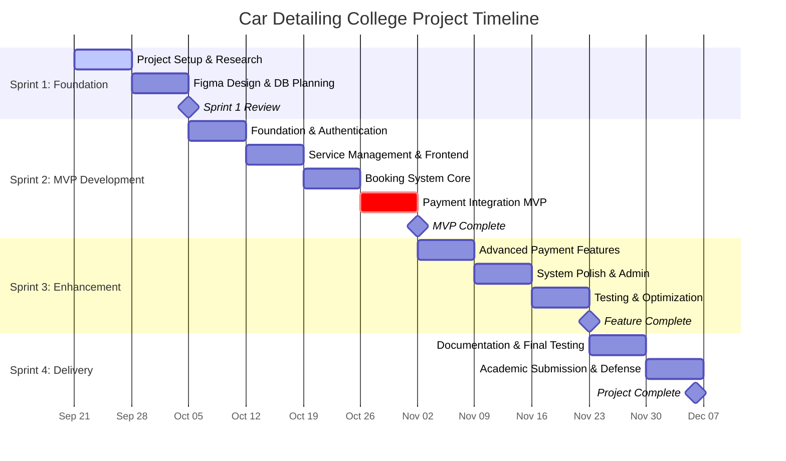

# 📊 Visual Gantt Chart Code for Car Detailing College Project

## 🎯 **OPTION 1: TeamGantt.com Format**
Copy this code to TeamGantt or similar tools:

```
Project: Car Detailing System (College Project)
Start Date: 2025-09-21
End Date: 2025-12-06

SPRINT 1: PROJECT FOUNDATION & DESIGN
├── Week 1: Project Setup & Research, 2025-09-21, 2025-09-27, 7d
├── Week 2: Figma Design & Database Planning, 2025-09-28, 2025-10-04, 7d

SPRINT 2: CORE DEVELOPMENT (LEAN MVP)
├── Week 3: Foundation & Authentication, 2025-10-05, 2025-10-11, 7d
├── Week 4: Service Management & Frontend, 2025-10-12, 2025-10-18, 7d
├── Week 5: Booking System Core, 2025-10-19, 2025-10-25, 7d
├── Week 6: Payment Integration MVP, 2025-10-26, 2025-11-01, 7d

SPRINT 3: ENHANCEMENT & REFINEMENT
├── Week 7: Advanced Payment Features, 2025-11-02, 2025-11-08, 7d
├── Week 8: System Polish & Admin Features, 2025-11-09, 2025-11-15, 7d
├── Week 9: Testing & Optimization, 2025-11-16, 2025-11-22, 7d

SPRINT 4: FINAL DELIVERY
├── Week 10: Documentation & Final Testing, 2025-11-23, 2025-11-29, 7d
├── Week 11: Academic Submission & Defense, 2025-11-30, 2025-12-06, 7d
```

## 🎯 **OPTION 2: Mermaid Gantt Chart (GitHub/GitLab)**
Copy this code to any Mermaid-supported platform:



## 🎯 **OPTION 3: CSV Format (Excel/Google Sheets)**
Copy this data to create your own Gantt chart:

```csv
Task Name,Start Date,End Date,Duration,Sprint,Status,Academic Focus
"Project Setup & Research","2025-09-21","2025-09-27",7,"Sprint 1","Completed","Requirements & Planning"
"Figma Design & DB Planning","2025-09-28","2025-10-04",7,"Sprint 1","Completed","UI/UX & Database Design"
"Foundation & Authentication","2025-10-05","2025-10-11",7,"Sprint 2","In Progress","Core Development"
"Service Management & Frontend","2025-10-12","2025-10-18",7,"Sprint 2","Planned","Frontend Integration"
"Booking System Core","2025-10-19","2025-10-25",7,"Sprint 2","Planned","Core Features"
"Payment Integration MVP","2025-10-26","2025-11-01",7,"Sprint 2","Planned","MVP Completion"
"Advanced Payment Features","2025-11-02","2025-11-08",7,"Sprint 3","Planned","Enhancement Phase"
"System Polish & Admin Features","2025-11-09","2025-11-15",7,"Sprint 3","Planned","Feature Enhancement"
"Testing & Optimization","2025-11-16","2025-11-22",7,"Sprint 3","Planned","Quality Assurance"
"Documentation & Final Testing","2025-11-23","2025-11-29",7,"Sprint 4","Planned","Academic Deliverables"
"Academic Submission & Defense","2025-11-30","2025-12-06",7,"Sprint 4","Planned","Project Submission"
```

## 🎯 **OPTION 4: GanttProject Format**
For GanttProject software (.gan file):

```xml
<?xml version="1.0" encoding="UTF-8"?>
<project name="Car Detailing System" company="1 Man Army Detailing" webLink="" view-date="2025-09-21" view-index="0" gantt-divider-location="300" resource-divider-location="300" version="3.2.3247" locale="en_US">
  <description>Car detailing business management system with payment-first booking</description>
  <view zooming-state="default:3" id="gantt-chart">
    <field id="tpd3" name="Name" width="167" order="0"/>
    <field id="tpd4" name="Begin date" width="65" order="1"/>
    <field id="tpd5" name="End date" width="64" order="2"/>
    <option id="taskLabelUp" value=""/>
  </view>
  <calendars>
    <day-types>
      <day-type id="0"/>
      <day-type id="1"/>
      <default-week id="1" name="default" sun="1" mon="0" tue="0" wed="0" thu="0" fri="0" sat="1"/>
    </day-types>
  </calendars>
  <tasks empty-milestones="true">
    <taskproperties>
      <taskproperty id="tpd0" name="type" type="default" valuetype="icon"/>
      <taskproperty id="tpd1" name="priority" type="default" valuetype="icon"/>
      <taskproperty id="tpd2" name="info" type="default" valuetype="icon"/>
      <taskproperty id="tpd3" name="name" type="default" valuetype="text"/>
      <taskproperty id="tpd4" name="begindate" type="default" valuetype="date"/>
      <taskproperty id="tpd5" name="enddate" type="default" valuetype="date"/>
      <taskproperty id="tpd6" name="duration" type="default" valuetype="int"/>
      <taskproperty id="tpd7" name="completion" type="default" valuetype="int"/>
      <taskproperty id="tpd8" name="coordinator" type="default" valuetype="text"/>
      <taskproperty id="tpd9" name="predecessorsr" type="default" valuetype="text"/>
    </taskproperties>
  </tasks>
</project>
```

## 🚀 **QUICK START INSTRUCTIONS:**

### **For Leadership Presentation (RECOMMENDED):**
1. **Use OPTION 2 (Mermaid)** - Copy the Mermaid code
2. Go to **https://mermaid.live/** 
3. Paste the code and get instant visual Gantt chart
4. Export as PNG/SVG for presentations

### **For Project Management:**
1. **Use OPTION 1** with **TeamGantt.com** (free trial)
2. **Use OPTION 3** with **Google Sheets** (free)
3. **Use OPTION 4** with **GanttProject** (free software)

## 📊 **VISUAL TIMELINE SUMMARY (COLLEGE PROJECT):**

```
Sep 21 ─────── Oct 4 ─────── Nov 1 ─────── Nov 22 ─────── Dec 6
  │              │             │             │             │
SPRINT 1      SPRINT 2      SPRINT 3      SPRINT 4    SUBMISSION
Foundation    MVP Dev       Enhancement   Final       (11 weeks)
(2 weeks)     (4 weeks)     (3 weeks)     (2 weeks)
  │              │             │             │
✅ Figma       🔄 Payment    � Polish     📋 Defense
✅ Database    🔄 Booking    � Testing    📋 Documentation
```

**Current Status (Oct 9):** Week 3 - Foundation Development ✅ 
**Next Sprint Goal:** MVP Payment System (Week 6) 🎯
**Final Deadline:** December 6, 2025 (Academic Submission) 📅

## 🎓 **ACADEMIC PROJECT HIGHLIGHTS:**

### **Lean Methodology Application:**
- **Build-Measure-Learn** cycles every 2 weeks
- **MVP approach** with iterative improvements
- **Sprint reviews** for continuous feedback
- **Academic requirements** integrated throughout

### **Real-World Business Application:**
- **Payment-first booking** for actual business model
- **"1 Man Army"** service business simulation
- **Modern web technologies** (PHP, MySQL, Bootstrap)
- **Professional development practices** (Git, documentation)

This gives you a realistic college project timeline with professional development practices! 🚀