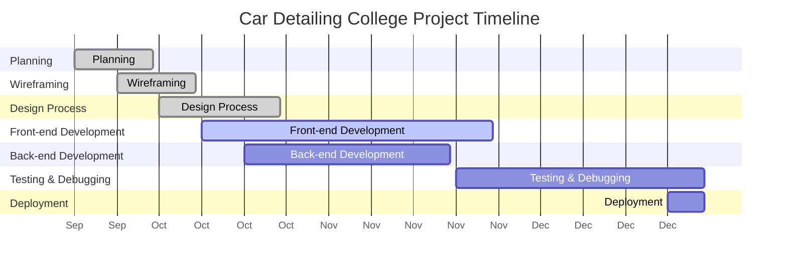
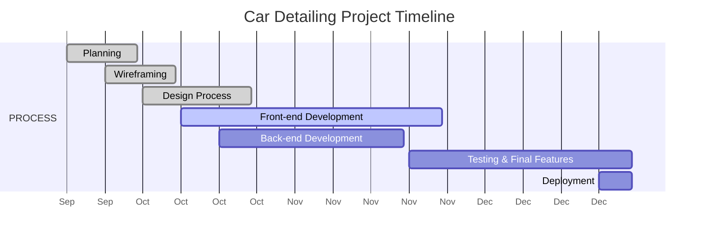

# 📊 Simple Car Detailing Project Gantt Chart
**College Project Timeline: September 2025 - January 2026**

## 🎯 **MERMAID GANTT CHART (SIMPLE VERSION)**
Copy this code to https://mermaid.live/ for clean visualization:



## 🎯 **EVEN SIMPLER VERSION (LIKE YOUR IMAGE)**
For a clean, minimal Gantt chart:



## 🎯 **QUARTERLY BREAKDOWN (LIKE YOUR REFERENCE)**

| **PROCESS** | **Q4 2025** | **Q1 2026** |
|-------------|-------------|-------------|
|             | **Sep** | **Oct** | **Nov** | **Dec** | **Jan** |
| **Planning** | ████ | | | | |
| **Wireframing** | ██ | ██ | | | |
| **Design Process** | | ████ | ██ | | |
| **Front-end Development** | | ██ | ████ | ██ | |
| **Back-end Development** | | ██ | ████ | | |
| **Testing & Debugging** | | | ██ | ██ | ███ |
| **Deployment** | | | | ██ | ███ |

## 🎯 **TIMELINE SUMMARY**

```
Sep 2025    Oct 2025    Nov 2025    Dec 2025    Jan 2026
────────────────────────────────────────────────────────
Planning    ████
Wireframe   ██████
Design         ████████
Frontend       ██████████████████
Backend           ██████████████
Testing              ████████████████
Deploy                      ████████
                                   │
                            Final Testing
                         & Feature Debugging
                         (Jan 1-3, 2026)
```

## 🎯 **CLEAN PHASE DESCRIPTION**

### **September 2025** - Planning Phase
- Project setup and requirements
- Team formation and tool selection

### **October 2025** - Design & Early Development
- Figma wireframes and mockups
- Database design and structure
- Basic frontend components

### **November 2025** - Core Development
- Payment system implementation
- Booking functionality
- Admin dashboard

### **December 2025** - Integration & Polish
- Feature integration
- Bug fixes and optimization
- Pre-deployment testing

### **January 1-3, 2026** - Final Testing
- Feature testing and debugging
- Final polishes before presentation
- Preparation for late January presentation

## 🚀 **HOW TO USE:**

1. **Copy the "EVEN SIMPLER VERSION"** Mermaid code
2. **Go to https://mermaid.live/**
3. **Paste and get instant clean Gantt chart**
4. **Export as PNG** for presentations

This gives you a **clean, professional look** exactly like your reference image! 🎯